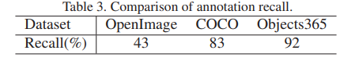

# A quick draft to summarize

The topics to summarize:
- Objects365 
- Glip summary
- Grounding DINO

---

## Objects365

Objects365 is a dataset collected from "Flicker" (Image sharing website).

## Dataset information

Objects365 has the following characteristic:
- 638,010 images.
- 10M+ bounding box.
- 365 Objects
- Objects365 focus on [Scale, Quality, Generalization]

### Data collection approach of Objects365 dataset ?

They firstly picked 11 categories which later called (Super categories), Also it's common & diverse objects.

From those 11 objects they proposed 442 categories. Also it's widely used in our daily life.

But some of the 442 objects are "rarely" found in our dayily life so they annotate the (442 objects in 100K images) Then picked up only the most frequent (365 category).

Note: the 365 categories are included also in "PASCAL VOC and COCO benchmarks".

*Figure 1, Objects365 dataset structure.*

### Non-Iconic Images (Elimination process)

The approach to eliminate non-suitable images:
- If image contains only 1 object around the center of an image ==> discard it.

Note: This first adopted by COCO*

### Annotation section

*Figure 2, Table comparison of multiple datasets, With objects365 dataset* 

#### Annotation steps
They have a pipeline for annotation, Which passes 3 steps which are:

- 1st: Perform two class classification If image non-iconic or contains at least 1 object in 11 super categories.
- 2nd: The image-level tag with 11 super categoies will be labeled.
    - An image maybe labeled with more than one tag.
- 3rd: One annotator will be assigned to label the object instances in one specific 11 super category.
    - Notice: all objects belonging to 11 super category should be labeled with (Bounding box + object name) together.

*Figure 3, Objects365 pipeline annotation process*

---

### Annotation Process Consistency 

Since the dataset is quite large, They defined annotation rules to remain consistent (Since also the annotators will be involved)

The problem are:
- Annotators ==> annotate an image ==> different annotation result (Result is ambigious)

Rules for annotation:
- Classification rule
- Bounding-box rule

#### Classification rule

follows the "Function-first" principle, The label that best reflects the object's intended use or primary function should be chosen first.

*Figure 4, Showcase of Function-first principle*

#### Bounding Box Rules

If a clock has a fancy part (like decoration) that's still part of the clock and won't confuse it for something else, include it in the box.

If you include part of the clock (like tower clock) confuse with something else don't include the part.

### Statistics

Based on annotation pipeline:
- Total image = 740K images
- Split of training, validation, testing which are,
    - 600K, 38K, 100K respectively.

#### Diversity of Objects365 images

*Figure 5, Diversity of Objects365 images*

According to authors of objects365 the dataset is more dense and diverse than [VOC, COCO, OpenImages] datasets.

Which have 5-category on AVG per image.

#### Image resolutions

#### Effective annotations

*Figure 6, Effective annotations with PASCAL, VOC, COCO benchmark*

Also the image resolutions is more diverse than COCO dataset.

*Figure 7,  Area of resolutions in Objects365 Vs. COCO*

## Quality

They asked "3" well-trained annotators to label 200 *randomly* selected images. In total, there are 3250 bounding boxes. The percentage of correct annotation was 92% of original annotation.

### Precesion approach

They considered a false positive if the object category is wrong or bounding-box not accurate.

The precesion was = 91.7%.

While COCO was 71.9% only.

## Experimentation

For the benchmark purpose they defined their model baseline with [FPN, RetinaNet]. Then focus on generalization abilities of these models.

### Experiment Setup

They used mmAP of COCO style for evaluation.

They also averaged the IOU 0.5: 0.05: 0.95 for all object categories.

They also followed the settings for Detectron for COCO.

#### Training setting

their settings for training the detector:
- 8 GPU 1080 TI
- Batch size = 16
- image size  = 800 x 1333

For training with *Objects365* they used learning rate schedule with (learning rate of 0.02.)
- decrease factor = 10 at 900K & 1200K.

Stopped the training = 1350K iteration.

They also used Syn the batch normalization with Objects365.

*Note: Other dataset they followed the standard settings.*

### Results on Object365

*Table 2: describe the splitting for each set*

*Table 4: describe the results of FPN & RetinaNet algorithms on Objects365*

The results on table 4 reported from the validation set which is indicated from table 2.

We can see that "mmAP" metric for **FPN** network that had been validated on the validation set which is 22.5 mmAP.
- For COCO it's 38.3.
- Objects365 authors said the result is lower than COCO beacuse their dataset is more challenging.

But, When they analyzed Objects365 results by selecting 80 categories from COCO and re-test again they got 38.5 for **FPN** & 34.5 for **RetinaNet**.

---

#### Detailed breakdown of False positive

They compare the results of Objects365 & COCO. They found out there GAP between them lies in **Recall** (between BG & FN)

*Figure 8, plots of Precesion & Recall for Objects365 and COCO*

To summarize it:
- On left => Objects365
- In Middle => Model pre-trained on Imagenet and tested on COCO.
- On Right => Model pre-trained on Objects365 and tested on COCO.

**Note: All models are FPN based on Resnet50 backbone.**

For more info on these error metrics: https://cocodataset.org/#detection-eval

Simply focus INMHO:
- FN (False negative): These are errors that occur when the object detector fails to identify object that actually present in the image.
- BG (Background error): Happens when object detector mistakenly identifies the background region as an object of interest.

---

### Generalization Ability of Object365

They used COCO & Pascal VOC => evaluate general object detection.

CityPersons => evaluate pedestrain detection.

Pascal VOC & ADE => For semantic segmentation.

---

### Learning rate strategy

